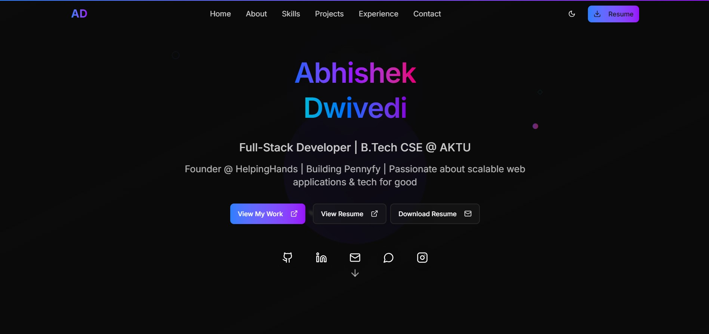
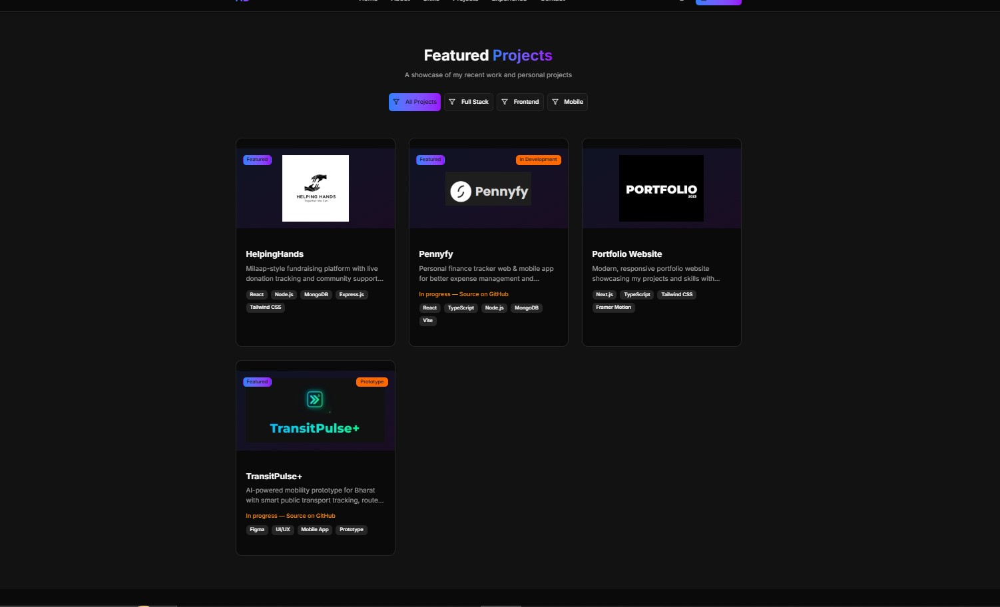
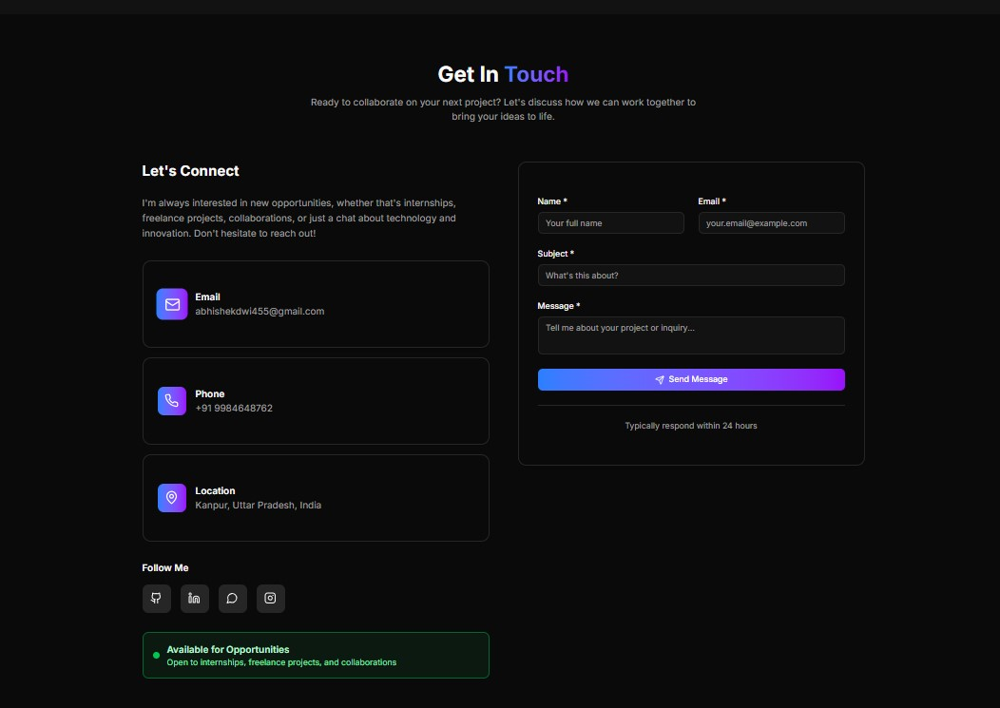

# 🌐 Personal Portfolio

A modern, responsive portfolio website showcasing my projects, technical skills, experience and professional journey as a Full Stack Developer.

🌍 **Live Website**
https://abhishekdwivedi-portfolio.vercel.app

---

## 🚀 Features

* Modern and responsive user interface
* Dark and light theme support
* Smooth animations and transitions
* Project showcase with featured work
* Resume view and download functionality
* Functional contact form integration
* Open Graph and social sharing support
* Custom favicon and branding
* Mobile-friendly design

---

## 📸 Screenshots

### Home Page

### Projects Section

### Contact Section

---

## 🛠 Tech Stack

### Frontend

* Next.js
* React
* TypeScript
* Tailwind CSS
* Framer Motion

### Deployment

* Vercel

---

## 📌 Sections

* Home
* About
* Skills
* Projects
* Experience
* Contact

---

## 🌟 Featured Projects

### 🚍 TransitPulse

AI-powered public transport platform featuring ETA prediction, crowd analytics, live tracking and sustainability insights.

### 🤝 HelpingHands

Community-driven donation platform focused on social impact and accessibility.

---

## 📄 Resume

Visitors can view and download my resume directly from the portfolio.

---

## 📬 Contact

The portfolio includes a working contact form allowing visitors, recruiters and collaborators to get in touch directly.

---

## 👨‍💻 Author

### Abhishek Dwivedi

🌐 Portfolio
https://abhishekdwivedi-portfolio.vercel.app

💼 LinkedIn
https://www.linkedin.com/in/abhishekdwivedi29/

📧 Email
[abhishekdwi455@gmail.com](mailto:abhishekdwi455@gmail.com)

---

⭐ Built using modern web technologies with a focus on performance, accessibility and user experience.
